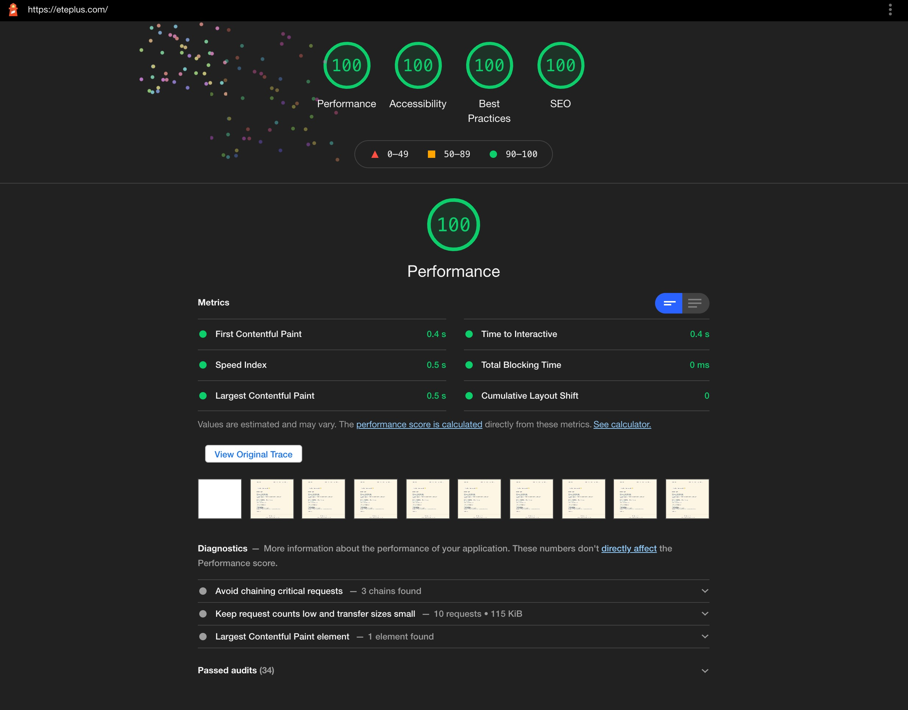

# Just a blog

> A [blog](https://eteplus.com) powered by [Zola](https://www.getzola.org/documentation/getting-started/installation/) and [Tailwindcss](https://tailwindcss.com/)

## Preview
<center>
  
  
</center>

## Requirements

- [node](https://pnpm.io/installation) >= 16.2.0
- [zola](https://www.getzola.org/documentation/getting-started/installation/)

## Project setup

```
npm install
```

### Compiles and hot-reloads for development

```
npm run serve
```

### Compiles and minifies for production

```
npm run build
```